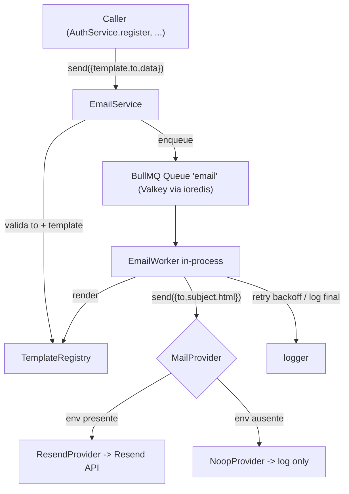

# Email Module — Design

**Spec**: `.specs/features/email-module/spec.md`
**Context**: `.specs/features/email-module/context.md`
**Status**: Draft — aguardando aprovação

---

## Architecture Overview

Módulo centralizado `src/modules/email` seguindo o padrão do backend (`Service` + arquivos coesos). Envio **assíncrono** via fila BullMQ sobre Valkey. Callers só enfileiram; um worker in-process renderiza o template (react-email) e despacha pelo `MailProvider` (Resend). Provider e templates são abstraídos e versionados.



**Ciclo de vida:** a fila e o worker sobem em `server.ts` no boot e param no graceful shutdown (junto com `closeCache`). Enqueue é não-bloqueante; falha de enqueue é logada e engolida pelo caller.

---

## Code Reuse Analysis

### Existing Components to Leverage

| Component | Location | How to Use |
| --- | --- | --- |
| Padrão de módulo (Service coeso) | `src/modules/notifications/*` | Espelhar estrutura e estilo. |
| `AppError` | `src/lib/errors.ts` | `AppError.validation` p/ `to`/template inválido no enqueue. |
| Logger | `src/logger.ts` | `logInfo/logWarn/logError` em enqueue, worker e providers. |
| Config pattern | `src/config.ts` | Adicionar envs de e-mail via `getConfig()` + parsers. |
| Valkey URL | `process.env.VALKEY_URL` (usado em `src/lib/cache.ts`) | Reusar a mesma instância Valkey p/ a conexão ioredis do BullMQ. |
| Registro de rotas / boot | `src/app.ts`, `src/server.ts` | Iniciar/parar worker no lifecycle do servidor. |
| Padrão de teste | `tests/unit/modules/*`, `tests/integration/*` | Vitest + mocks (hoisted), threshold 80%. |
| Fluxo de registro | `src/modules/auth/**` (`AuthService.register`) | Ponto de gatilho do e-mail de boas-vindas. |

### Integration Points

| System | Integration Method |
| --- | --- |
| Valkey | Nova conexão `ioredis` (BullMQ exige) ao mesmo `VALKEY_URL`, prefixo de chaves próprio (`bull:email`). Não interfere no `node-redis` do cache. |
| Auth (registro) | `AuthService.register` chama `emailService.sendWelcome(...)` dentro de try/catch que só loga. |
| Resend | HTTP via SDK `resend` usando `EMAIL_API_KEY`. |

---

## Components

### EmailService
- **Purpose**: API interna única de e-mail. Valida e enfileira jobs.
- **Location**: `src/modules/email/email.service.ts`
- **Interfaces**:
  - `send(input: { template: TemplateName; to: string; data: TemplateData }): Promise<void>` — valida `to` (formato) e `template` (existe no registry); enfileira job; nunca aguarda entrega. Erros de validação lançam `AppError.validation`; falha de enqueue é logada e **não** propagada.
  - `sendWelcome(user: { email: string; name: string }): Promise<void>` — açúcar sobre `send` com template `welcome`.
- **Dependencies**: `EmailQueue`, `TemplateRegistry`, logger.
- **Reuses**: `AppError`, logger.

### EmailQueue
- **Purpose**: Encapsula a fila BullMQ e sua conexão Valkey.
- **Location**: `src/modules/email/email.queue.ts`
- **Interfaces**:
  - `getEmailQueue(): Queue<EmailJobData>` — singleton lazy da `Queue`.
  - `enqueueEmail(data: EmailJobData): Promise<void>` — adiciona job com opções de retry/backoff.
  - `closeEmailQueue(): Promise<void>` — fecha conexão no shutdown.
- **Dependencies**: `bullmq`, `ioredis`, `VALKEY_URL`.
- **Reuses**: padrão singleton de `src/lib/cache.ts`.
- **Config da conexão**: `new IORedis(VALKEY_URL, { maxRetriesPerRequest: null })` (requisito do BullMQ).

### EmailWorker
- **Purpose**: Processa jobs: renderiza template → despacha via provider.
- **Location**: `src/modules/email/email.worker.ts`
- **Interfaces**:
  - `startEmailWorker(): Worker<EmailJobData>` — cria e retorna o `Worker` (chamado no boot).
  - `stopEmailWorker(): Promise<void>` — fecha o worker no shutdown.
  - processor: `async (job) => { html = registry.render(job.data); await provider.send({ to, subject, html }); }`
- **Dependencies**: `TemplateRegistry`, `MailProvider` (via factory), logger.
- **Retry**: `attempts: 3`, `backoff: { type: 'exponential', delay: 2000 }` (config). Falha final logada em `worker.on('failed')`.

### MailProvider (interface) + factory
- **Purpose**: Contrato de envio, desacoplando o provedor concreto.
- **Location**: `src/modules/email/providers/mail-provider.ts` (interface + `getMailProvider()` factory)
- **Interfaces**:
  - `interface MailProvider { send(msg: { to: string; subject: string; html: string; replyTo?: string }): Promise<void> }`
  - `getMailProvider(): MailProvider` — retorna `ResendProvider` se `EMAIL_API_KEY` presente, senão `NoopProvider`.
- **Reuses**: config, logger.

### ResendProvider
- **Location**: `src/modules/email/providers/resend.provider.ts`
- **Interfaces**: `send(...)` via SDK `resend` (`resend.emails.send({ from, to, subject, html, replyTo })`). Lança em falha (BullMQ faz retry).
- **Dependencies**: `resend`, config (`EMAIL_API_KEY`, `EMAIL_FROM_ADDRESS`, `EMAIL_FROM_NAME`).

### NoopProvider
- **Location**: `src/modules/email/providers/noop.provider.ts`
- **Interfaces**: `send(...)` → `logWarn("Email disabled: no provider configured", {...})`. Não lança (EMAIL-09).

### TemplateRegistry + templates
- **Purpose**: Mapear `TemplateName → { subject, render(data) }`, validando nomes e renderizando react-email para HTML.
- **Location**: `src/modules/email/templates/registry.ts`, `src/modules/email/templates/welcome.tsx`, `src/modules/email/templates/BaseLayout.tsx`
- **Interfaces**:
  - `type TemplateName = 'welcome'`
  - `isTemplate(name: string): name is TemplateName`
  - `renderTemplate(name, data): Promise<{ subject: string; html: string }>` — usa `render()` (async) do `@react-email/render`.
- **Dependencies**: `react`, `react-dom`, `@react-email/render`.

### Rotas / Boot
- **Location**: `src/server.ts` — chamar `startEmailWorker()` no boot e `stopEmailWorker()`/`closeEmailQueue()` no shutdown.
- Sem rota HTTP nova no MVP (contato fora de escopo). O módulo é consumido internamente.

---

## Data Models

### EmailJobData (payload do job BullMQ)
```typescript
interface EmailJobData {
  template: TemplateName;        // 'welcome'
  to: string;                    // e-mail destino (validado no enqueue)
  data: Record<string, unknown>; // props do template (ex.: { name })
}
```
**Relationships**: efêmero (fila). Sem persistência em DB (decisão: só log).

### Config additions (`src/config.ts`)
```typescript
interface AppConfig {
  // ...
  emailApiKey: string;        // EMAIL_API_KEY (vazio => NoopProvider)
  emailFromAddress: string;   // EMAIL_FROM_ADDRESS
  emailFromName: string;      // EMAIL_FROM_NAME
  emailQueueAttempts: number; // EMAIL_QUEUE_ATTEMPTS (default 3)
}
```
`.env.example` ganha: `EMAIL_API_KEY=`, `EMAIL_FROM_ADDRESS=`, `EMAIL_FROM_NAME=`, `EMAIL_QUEUE_ATTEMPTS=3`.

**URL do CTA:** o botão "Acessar plataforma" do template `welcome` reusa a env **`FRONTEND_URL`** (já existente em `.env.example` e usada em `auth.controller.ts`). Nenhuma env de URL nova é criada. O `welcome.tsx` recebe `appUrl` como prop, injetada pelo `EmailService.sendWelcome` a partir de `config.frontendUrl`.

---

## Error Handling Strategy

| Error Scenario | Handling | Impacto |
| --- | --- | --- |
| `to` inválido / template desconhecido no enqueue | `AppError.validation` lançado ao caller | Caller trata (é bug de programação interno). EMAIL-05. |
| Falha ao enfileirar (Valkey down) | log de erro, exceção engolida em `send` | Fluxo de negócio (registro) segue normal. EMAIL-10, EMAIL-13→10. |
| Falha do provider no worker | throw → BullMQ retry (3x, backoff exp.) | Transparente; e-mail eventualmente entregue ou logado no fracasso final. EMAIL-03. |
| Fracasso final após retries | `worker.on('failed')` → `logError` | Nenhum; e-mail perdido é logado (sem DB no MVP). EMAIL-03. |
| Env de e-mail ausente | `getMailProvider()` retorna `NoopProvider` (loga) | API sobe e opera; e-mails viram no-op logado. EMAIL-09. |

---

## Risks & Concerns

| Concern | Location | Impact | Mitigation |
| --- | --- | --- | --- |
| JSX/React no backend (hoje sem react/tsconfig JSX) | `backend/tsconfig*.json` | Build quebra sem `jsx: react-jsx` e sem deps React | Task dedicada: instalar `react@19`,`react-dom@19`,`@types/react@19` (casar frontend) + ativar JSX no tsconfig. Verificado como compatível. |
| Conflito de versões React 19 x `@types/react@18` | `backend/package.json` | Erros de tipo no `render()` | Fixar `@types/react@19` (bug conhecido documentado). |
| Nova conexão ioredis ao Valkey (além do node-redis) | `email.queue.ts` | Duas libs de client no mesmo processo | Aceitável: BullMQ exige ioredis; escopo isolado ao módulo, prefixo `bull:email`. Sem impacto no cache existente. |
| Worker in-process compete por CPU/event-loop com a API | `server.ts` | Em volume alto, render+envio pode pesar | Volume MVP é baixo (boas-vindas). Concurrency baixa no worker; extraível p/ processo separado depois sem mudar a fila (AD-002). |
| Perda de e-mail no fracasso final (sem DB) | worker | E-mail não entregue só vira log | Aceito no MVP (decisão do usuário). `email_logs` é evolução futura registrada em Out of Scope. |
| Testar código que toca Valkey/BullMQ real | testes | Testes lentos/flaky se conectarem de verdade | Mockar `email.queue` e `MailProvider`; testar `EmailService`/worker com fakes em memória (padrão hoisted já usado no repo). |

> Concern flag: `AuthService.register` precisa de um try/catch ao redor do `sendWelcome` — hoje não existe; a task de integração adiciona sem alterar o contrato de retorno do registro.

---

## Tech Decisions

| Decisão | Escolha | Rationale |
| --- | --- | --- |
| Transporte | BullMQ sobre Valkey (ioredis) | Fila durável com retry/backoff nativo; base p/ futuros alertas de vagas. AD-002. |
| Provider | Resend atrás de `MailProvider` | Decisão do usuário; troca barata. AD-003. |
| Templates | react-email, React fixo em 19.x | Casa com frontend; evita quebra de build. AD-004. |
| Worker | In-process (boot em server.ts) | Simples p/ MVP; extraível depois. |
| Sem provider configurado | NoopProvider (no-op + log) | Dev local sobe sem credenciais. |
| Persistência | Nenhuma (só log) | Decisão do usuário; `email_logs` futuro. |

> Decisões de nível de projeto já registradas em `.specs/STATE.md` como AD-001..AD-004.

---

## Open decisions

Nenhuma — todas confirmadas com o usuário. Pronto para a fase de Tasks.
